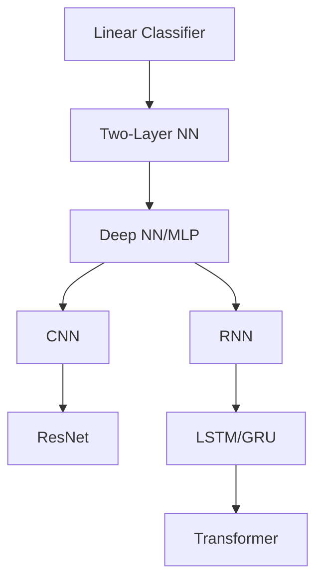
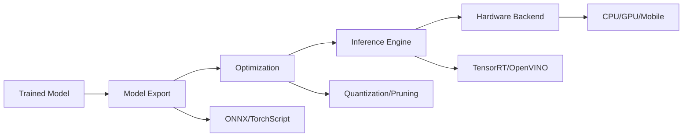

# Deep Learning Systems Theory Interview Study Guide

## Table of Contents
1. [Introduction to Deep Learning Systems](#1-introduction-to-deep-learning-systems)
2. [Machine Learning Fundamentals & Softmax Regression](#2-machine-learning-fundamentals--softmax-regression)
3. [Automatic Differentiation](#3-automatic-differentiation)
4. [Neural Network Architectures](#4-neural-network-architectures)
5. [Optimization & Training](#5-optimization--training)
6. [Neural Network Library Abstractions](#6-neural-network-library-abstractions)
7. [Hardware Acceleration](#7-hardware-acceleration)
8. [Convolutional Networks](#8-convolutional-networks)
9. [Training Large Models](#9-training-large-models)
10. [Generative Models](#10-generative-models)
11. [Model Deployment](#11-model-deployment)

---

## 1. Introduction to Deep Learning Systems

### Key Concepts
**Deep Learning Systems** are the infrastructure that enables automatic differentiation, neural network architectures, optimization, and efficient operations on GPUs.

### Why Study Deep Learning Systems?
- **Build New Systems**: Understanding internals helps develop/extend frameworks
- **Use Existing Systems Effectively**: Performance optimization requires system knowledge  
- **It's Fun!**: Core algorithms are surprisingly simple - you can write a reasonable DL library in <2000 lines of code

### Elements of Deep Learning Systems
1. **Compose multiple tensor operations** to build ML models
2. **Transform a sequence of operations** (automatic differentiation)
3. **Accelerate computation via specialized hardware**
4. **Extend more hardware backends and operators**

### Course Structure Example (Needle Library)
```python
# Example: Building a simple neural network with Needle
import needle as ndl

# Define model
class MLP(ndl.nn.Module):
    def __init__(self, input_size, hidden_size, output_size):
        self.linear1 = ndl.nn.Linear(input_size, hidden_size)
        self.relu = ndl.nn.ReLU()
        self.linear2 = ndl.nn.Linear(hidden_size, output_size)
    
    def forward(self, x):
        x = self.linear1(x)
        x = self.relu(x)
        x = self.linear2(x)
        return x
```

---

## 2. Machine Learning Fundamentals & Softmax Regression

### Three Ingredients of ML Algorithm

| Component | Description | Example |
|-----------|-------------|---------|
| **Hypothesis Class** | Program structure that maps inputs to outputs | Linear: `h_θ(x) = θᵀx` |
| **Loss Function** | Measures how well hypothesis performs | Cross-entropy, MSE |
| **Optimization Method** | Procedure to find optimal parameters | SGD, Adam |

### Multi-class Classification Setting
- **Inputs**: `x_i ∈ ℝⁿ` (e.g., 784 for 28×28 MNIST)
- **Labels**: `y_i ∈ {1, 2, ..., k}` (e.g., 10 for MNIST digits)
- **Training set size**: `m` examples

### Loss Functions Comparison

| Loss Function | Formula | Properties | Use Case |
|---------------|---------|------------|----------|
| **Classification Error** | `l_err = 1[ŷ ≠ y]` | ❌ Not differentiable | Evaluation only |
| **Softmax/Cross-Entropy** | `l_ce = -log(p_y)` | ✅ Differentiable | Training |

### Softmax Function
```python
def softmax(logits):
    """Convert logits to probabilities"""
    exp_logits = np.exp(logits - np.max(logits))  # Numerical stability
    return exp_logits / np.sum(exp_logits, axis=-1, keepdims=True)

def cross_entropy_loss(logits, y):
    """Cross-entropy loss"""
    probs = softmax(logits)
    return -np.log(probs[y])
```

### Gradient Descent
```python
def gradient_descent(theta, learning_rate, gradient):
    """Basic gradient descent update"""
    return theta - learning_rate * gradient

def sgd_update(theta, X_batch, y_batch, learning_rate):
    """Stochastic gradient descent update"""
    # Forward pass
    logits = X_batch @ theta
    probs = softmax(logits)
    
    # Compute gradient
    gradient = X_batch.T @ (probs - one_hot(y_batch)) / len(X_batch)
    
    # Update parameters
    return theta - learning_rate * gradient
```

---

## 3. Automatic Differentiation

### Differentiation Methods Comparison

| Method | Pros | Cons | Best For |
|--------|------|------|----------|
| **Numerical** | Simple to implement | Numerical errors, inefficient | Testing AD algorithms |
| **Symbolic** | Exact | Expression swell, inefficient | Simple functions |
| **Automatic** | Exact + efficient | Implementation complexity | Deep learning |

### Computational Graph


A **computational graph** is a directed acyclic graph where:
- **Nodes** represent intermediate values
- **Edges** represent input-output relations

### Forward vs Reverse Mode AD

| Mode | Efficiency | Direction | Best For |
|------|------------|-----------|----------|
| **Forward Mode** | `O(n)` passes for `n` inputs | Input → Output | Few inputs, many outputs |
| **Reverse Mode** | `O(1)` pass | Output → Input | Many inputs, few outputs (ML) |

### Reverse Mode AD Algorithm
```python
def reverse_mode_ad(computational_graph, output_grad=1.0):
    """
    Reverse mode automatic differentiation
    """
    # 1. Initialize gradient of output node
    node_to_grad = {output_node: output_grad}
    
    # 2. Traverse nodes in reverse topological order
    for node in reversed(topological_order):
        if node in node_to_grad:
            grad_output = node_to_grad[node]
            
            # 3. For each input to this node
            for input_node in node.inputs:
                # Compute partial gradient
                partial_grad = grad_output * compute_local_gradient(node, input_node)
                
                # 4. Accumulate gradient
                if input_node not in node_to_grad:
                    node_to_grad[input_node] = 0
                node_to_grad[input_node] += partial_grad
    
    return node_to_grad
```

### Implementing AD: Example for Matrix Multiplication
```python
class MatMul:
    def __init__(self, A, B):
        self.A = A
        self.B = B
        self.output = A @ B
    
    def backward(self, grad_output):
        # Z = A @ B
        # dZ/dA = grad_output @ B.T
        # dZ/dB = A.T @ grad_output
        grad_A = grad_output @ self.B.T
        grad_B = self.A.T @ grad_output
        return grad_A, grad_B
```

### Numerical Gradient Checking
```python
def numerical_gradient_check(f, x, grad_analytical, eps=1e-7):
    """Check analytical gradients using numerical approximation"""
    grad_numerical = []
    for i in range(len(x)):
        x_plus = x.copy()
        x_minus = x.copy()
        x_plus[i] += eps
        x_minus[i] -= eps
        
        grad_i = (f(x_plus) - f(x_minus)) / (2 * eps)
        grad_numerical.append(grad_i)
    
    # Check if analytical and numerical gradients match
    diff = np.abs(grad_analytical - grad_numerical)
    return np.max(diff) < 1e-5  # Tolerance
```

---

## 4. Neural Network Architectures

### Architecture Evolution



### Fully Connected Networks (MLP)

```python
class MLP:
    def __init__(self, layer_sizes):
        self.weights = []
        self.biases = []
        
        for i in range(len(layer_sizes) - 1):
            # Kaiming initialization for ReLU
            w = np.random.normal(0, np.sqrt(2.0 / layer_sizes[i]), 
                               (layer_sizes[i], layer_sizes[i+1]))
            b = np.zeros(layer_sizes[i+1])
            self.weights.append(w)
            self.biases.append(b)
    
    def forward(self, x):
        activations = [x]
        
        for i, (w, b) in enumerate(zip(self.weights, self.biases)):
            z = activations[-1] @ w + b
            if i < len(self.weights) - 1:  # Apply ReLU to hidden layers
                a = np.maximum(0, z)  # ReLU
            else:
                a = z  # No activation on output layer
            activations.append(a)
        
        return activations
```

### Activation Functions Comparison

| Activation | Formula | Pros | Cons |
|------------|---------|------|------|
| **ReLU** | `max(0, x)` | Simple, no vanishing gradient | Dead neurons |
| **Sigmoid** | `1/(1+e^(-x))` | Smooth, bounded | Vanishing gradient |
| **Tanh** | `tanh(x)` | Zero-centered | Vanishing gradient |
| **Leaky ReLU** | `max(αx, x)` | Fixes dead neurons | Extra hyperparameter |

### Backpropagation Algorithm
```python
def backpropagation(activations, weights, y_true, y_pred):
    """
    Compute gradients using backpropagation
    """
    gradients_w = []
    gradients_b = []
    
    # Start with loss gradient
    delta = y_pred - y_true  # For cross-entropy loss
    
    # Backward pass through layers
    for i in reversed(range(len(weights))):
        # Gradient w.r.t. weights and biases
        grad_w = activations[i].T @ delta
        grad_b = np.sum(delta, axis=0)
        
        gradients_w.insert(0, grad_w)
        gradients_b.insert(0, grad_b)
        
        # Gradient w.r.t. previous layer activations
        if i > 0:
            delta = delta @ weights[i].T
            # Apply derivative of activation function
            delta = delta * (activations[i] > 0)  # ReLU derivative
    
    return gradients_w, gradients_b
```

---

## 5. Optimization & Training

### Optimization Algorithms Comparison

| Algorithm | Update Rule | Pros | Cons |
|-----------|-------------|------|------|
| **SGD** | `θ ← θ - α∇f(θ)` | Simple, well-understood | Can oscillate |
| **Momentum** | `v ← βv + ∇f(θ)`<br>`θ ← θ - αv` | Smooths updates | Extra hyperparameter |
| **Adam** | Adaptive learning rates | Often works well | Can overfit, complex |

### Adam Optimizer Implementation
```python
class Adam:
    def __init__(self, params, lr=1e-3, beta1=0.9, beta2=0.999, eps=1e-8):
        self.params = params
        self.lr = lr
        self.beta1 = beta1
        self.beta2 = beta2
        self.eps = eps
        self.t = 0  # Time step
        
        # Initialize moment estimates
        self.m = [np.zeros_like(p) for p in params]  # First moment
        self.v = [np.zeros_like(p) for p in params]  # Second moment
    
    def step(self, gradients):
        self.t += 1
        
        for i, (param, grad) in enumerate(zip(self.params, gradients)):
            # Update biased first moment estimate
            self.m[i] = self.beta1 * self.m[i] + (1 - self.beta1) * grad
            
            # Update biased second moment estimate
            self.v[i] = self.beta2 * self.v[i] + (1 - self.beta2) * grad**2
            
            # Compute bias-corrected first moment estimate
            m_hat = self.m[i] / (1 - self.beta1**self.t)
            
            # Compute bias-corrected second moment estimate
            v_hat = self.v[i] / (1 - self.beta2**self.t)
            
            # Update parameters
            param -= self.lr * m_hat / (np.sqrt(v_hat) + self.eps)
```

### Initialization Strategies

| Method | Formula | Best For |
|--------|---------|----------|
| **Xavier/Glorot** | `σ² = 2/(n_in + n_out)` | Tanh, Sigmoid |
| **Kaiming/He** | `σ² = 2/n_in` | ReLU networks |
| **Zero initialization** | `W = 0` | ❌ Never use (gradient = 0) |

### Regularization Techniques

| Technique | Implementation | Effect |
|-----------|----------------|--------|
| **L2 Regularization** | `loss += λ‖W‖²` | Prevents overfitting |
| **Dropout** | Randomly set activations to 0 | Reduces co-adaptation |
| **Batch Normalization** | Normalize layer inputs | Stabilizes training |

```python
def dropout(x, p=0.5, training=True):
    """Apply dropout regularization"""
    if not training:
        return x
    
    mask = np.random.binomial(1, 1-p, x.shape) / (1-p)
    return x * mask

def batch_norm(x, gamma=1, beta=0, eps=1e-8):
    """Batch normalization"""
    mean = np.mean(x, axis=0)
    var = np.var(x, axis=0)
    x_norm = (x - mean) / np.sqrt(var + eps)
    return gamma * x_norm + beta
```

---

## 6. Neural Network Library Abstractions

### Framework Evolution

| Framework | Year | Approach | Key Feature |
|-----------|------|----------|-------------|
| **Caffe** | 2014 | Layer-based | Forward/backward methods |
| **TensorFlow 1.x** | 2015 | Static graphs | Declarative programming |
| **PyTorch/Needle** | 2016 | Dynamic graphs | Imperative AD |

### Module Abstraction
```python
class Module:
    """Base class for all neural network modules"""
    
    def __init__(self):
        self.parameters = []
        self.training = True
    
    def forward(self, x):
        """Forward pass - must be implemented by subclasses"""
        raise NotImplementedError
    
    def __call__(self, x):
        return self.forward(x)
    
    def train(self):
        self.training = True
        for module in self.modules():
            module.train()
    
    def eval(self):
        self.training = False
        for module in self.modules():
            module.eval()

class Linear(Module):
    def __init__(self, in_features, out_features):
        super().__init__()
        self.weight = Parameter(torch.randn(in_features, out_features))
        self.bias = Parameter(torch.randn(out_features))
    
    def forward(self, x):
        return x @ self.weight + self.bias
```

### High-Level Components

| Component | Purpose | Example |
|-----------|---------|---------|
| **nn.Module** | Modular composition | Linear, Conv2d, ReLU |
| **Loss Functions** | Training objectives | CrossEntropyLoss, MSELoss |
| **Optimizers** | Parameter updates | SGD, Adam |
| **Data Loaders** | Batch processing | DataLoader with shuffling |

---

## 7. Hardware Acceleration

### Memory Hierarchy (CPU)

| Memory Type | Latency | Capacity | Access Pattern |
|-------------|---------|----------|----------------|
| **Registers** | 0.5 ns | KB | Direct |
| **L1 Cache** | 7 ns | 32-64 KB | Cache lines |
| **L2 Cache** | 20 ns | 256 KB - 1 MB | Cache lines |
| **DRAM** | 200 ns | GB | Pages |

### CPU Optimization Techniques

#### 1. Vectorization
```cpp
// Scalar version
for (int i = 0; i < n; i++) {
    c[i] = a[i] + b[i];
}

// Vectorized version (SSE/AVX)
for (int i = 0; i < n; i += 4) {
    __m128 va = _mm_load_ps(&a[i]);
    __m128 vb = _mm_load_ps(&b[i]);
    __m128 vc = _mm_add_ps(va, vb);
    _mm_store_ps(&c[i], vc);
}
```

#### 2. Cache-Aware Tiling
```python
def matmul_tiled(A, B, tile_size=64):
    """Cache-aware matrix multiplication"""
    n = A.shape[0]
    C = np.zeros((n, n))
    
    for i in range(0, n, tile_size):
        for j in range(0, n, tile_size):
            for k in range(0, n, tile_size):
                # Multiply tiles that fit in cache
                A_tile = A[i:i+tile_size, k:k+tile_size]
                B_tile = B[k:k+tile_size, j:j+tile_size]
                C[i:i+tile_size, j:j+tile_size] += A_tile @ B_tile
    
    return C
```

### GPU Programming Model (CUDA)

#### Thread Hierarchy
```
Grid → Thread Blocks → Threads
```

| Level | Description | Communication |
|-------|-------------|---------------|
| **Thread** | Basic execution unit | Registers |
| **Block** | Group of threads | Shared memory |
| **Grid** | Group of blocks | Global memory |

#### CUDA Kernel Example
```cuda
__global__ void vector_add(float* a, float* b, float* c, int n) {
    int idx = blockIdx.x * blockDim.x + threadIdx.x;
    
    if (idx < n) {
        c[idx] = a[idx] + b[idx];
    }
}

// Host code
int main() {
    // Launch kernel
    int threads_per_block = 256;
    int blocks = (n + threads_per_block - 1) / threads_per_block;
    vector_add<<<blocks, threads_per_block>>>(d_a, d_b, d_c, n);
}
```

#### Shared Memory Optimization
```cuda
__global__ void matmul_shared(float* A, float* B, float* C, int n) {
    __shared__ float As[TILE_SIZE][TILE_SIZE];
    __shared__ float Bs[TILE_SIZE][TILE_SIZE];
    
    int tx = threadIdx.x;
    int ty = threadIdx.y;
    int row = blockIdx.y * TILE_SIZE + ty;
    int col = blockIdx.x * TILE_SIZE + tx;
    
    float sum = 0.0f;
    
    for (int k = 0; k < n; k += TILE_SIZE) {
        // Cooperatively load tiles into shared memory
        As[ty][tx] = A[row * n + k + tx];
        Bs[ty][tx] = B[(k + ty) * n + col];
        
        __syncthreads();  // Wait for all threads in block
        
        // Compute partial result using shared memory
        for (int i = 0; i < TILE_SIZE; i++) {
            sum += As[ty][i] * Bs[i][tx];
        }
        
        __syncthreads();  // Wait before loading next tile
    }
    
    C[row * n + col] = sum;
}
```

---

## 8. Convolutional Networks

### CNN vs Fully Connected

| Aspect | Fully Connected | Convolutional |
|--------|-----------------|---------------|
| **Parameters** | O(input_size × hidden_size) | O(kernel_size²) |
| **Connectivity** | Global | Local |
| **Weight Sharing** | No | Yes |
| **Translation Invariance** | No | Yes |

### Convolution Operation
```python
def conv2d(input, kernel, stride=1, padding=0):
    """2D convolution operation"""
    # Add padding
    if padding > 0:
        input = np.pad(input, ((0,0), (0,0), (padding,padding), (padding,padding)))
    
    batch_size, in_channels, in_height, in_width = input.shape
    out_channels, in_channels, kernel_height, kernel_width = kernel.shape
    
    out_height = (in_height - kernel_height) // stride + 1
    out_width = (in_width - kernel_width) // stride + 1
    
    output = np.zeros((batch_size, out_channels, out_height, out_width))
    
    for b in range(batch_size):
        for oc in range(out_channels):
            for oh in range(out_height):
                for ow in range(out_width):
                    h_start = oh * stride
                    w_start = ow * stride
                    
                    # Extract patch
                    patch = input[b, :, h_start:h_start+kernel_height, 
                                    w_start:w_start+kernel_width]
                    
                    # Compute convolution
                    output[b, oc, oh, ow] = np.sum(patch * kernel[oc])
    
    return output
```

### CNN Building Blocks

| Component | Purpose | Parameters |
|-----------|---------|------------|
| **Convolution** | Feature extraction | kernel_size, stride, padding |
| **Pooling** | Spatial reduction | pool_size, stride |
| **Batch Norm** | Normalization | γ, β per channel |
| **Activation** | Non-linearity | None (ReLU) |

### Common CNN Architectures

#### LeNet-5 (1998)
```python
class LeNet5(nn.Module):
    def __init__(self):
        super().__init__()
        self.features = nn.Sequential(
            nn.Conv2d(1, 6, 5),      # 28x28 -> 24x24
            nn.ReLU(),
            nn.MaxPool2d(2),         # 24x24 -> 12x12
            nn.Conv2d(6, 16, 5),     # 12x12 -> 8x8
            nn.ReLU(),
            nn.MaxPool2d(2),         # 8x8 -> 4x4
        )
        self.classifier = nn.Sequential(
            nn.Linear(16 * 4 * 4, 120),
            nn.ReLU(),
            nn.Linear(120, 84),
            nn.ReLU(),
            nn.Linear(84, 10)
        )
```

#### ResNet Block
```python
class ResidualBlock(nn.Module):
    def __init__(self, channels):
        super().__init__()
        self.conv1 = nn.Conv2d(channels, channels, 3, padding=1)
        self.bn1 = nn.BatchNorm2d(channels)
        self.conv2 = nn.Conv2d(channels, channels, 3, padding=1)
        self.bn2 = nn.BatchNorm2d(channels)
        self.relu = nn.ReLU()
    
    def forward(self, x):
        residual = x
        out = self.relu(self.bn1(self.conv1(x)))
        out = self.bn2(self.conv2(out))
        out += residual  # Skip connection
        out = self.relu(out)
        return out
```

---

## 9. Training Large Models

### Memory Usage in Training

| Component | Memory Usage | Notes |
|-----------|--------------|-------|
| **Model Parameters** | O(P) | P = number of parameters |
| **Optimizer States** | O(P) to O(2P) | Adam stores momentum + variance |
| **Activations** | O(L × B × H) | L=layers, B=batch, H=hidden size |
| **Gradients** | O(P) | Same size as parameters |

### Activation Checkpointing
```python
class CheckpointFunction(torch.autograd.Function):
    @staticmethod
    def forward(ctx, run_function, preserve_rng_state, *args):
        ctx.run_function = run_function
        ctx.preserve_rng_state = preserve_rng_state
        
        # Don't save activations in forward pass
        with torch.no_grad():
            outputs = run_function(*args)
        
        return outputs
    
    @staticmethod
    def backward(ctx, *args):
        # Recompute activations during backward pass
        with torch.enable_grad():
            outputs = ctx.run_function(*args)
        
        # Compute gradients
        torch.autograd.backward(outputs, args)
```

### Parallel Training Strategies

| Strategy | Description | Communication | Memory |
|----------|-------------|---------------|--------|
| **Data Parallel** | Same model, different data | AllReduce gradients | Full model per GPU |
| **Model Parallel** | Different model parts | Send/Recv activations | Partial model per GPU |
| **Tensor Parallel** | Split tensors across GPUs | AllGather/AllReduce | Distributed tensors |

#### Data Parallel Training
```python
def all_reduce(tensors):
    """Sum tensors across all processes"""
    for tensor in tensors:
        dist.all_reduce(tensor, op=dist.ReduceOp.SUM)
        tensor /= dist.get_world_size()

def data_parallel_step(model, data, optimizer):
    # Forward pass on local batch
    loss = model(data)
    
    # Backward pass
    loss.backward()
    
    # Synchronize gradients across all processes
    all_reduce([p.grad for p in model.parameters()])
    
    # Update parameters
    optimizer.step()
    optimizer.zero_grad()
```

#### Tensor Parallel Example
```python
def tensor_parallel_linear(x, weight, bias=None):
    """Tensor parallel linear layer"""
    # Split weight across GPUs along output dimension
    local_weight = weight.chunk(world_size, dim=0)[rank]
    
    # Compute local output
    local_output = F.linear(x, local_weight, bias)
    
    # Gather outputs from all GPUs
    output = all_gather(local_output)
    
    return output
```

---

## 10. Generative Models

### Model Types Comparison

| Model Type | Training | Generation | Quality | Speed |
|------------|----------|------------|---------|-------|
| **GAN** | Adversarial | Single step | High | Fast |
| **VAE** | Likelihood | Single step | Medium | Fast |
| **Diffusion** | Denoising | Multi-step | Very High | Slow |
| **Autoregressive** | Next token | Sequential | High | Slow |

### Generative Adversarial Networks (GANs)

#### GAN Architecture
```python
class Generator(nn.Module):
    def __init__(self, noise_dim=100, output_channels=3):
        super().__init__()
        self.network = nn.Sequential(
            nn.Linear(noise_dim, 256),
            nn.ReLU(),
            nn.Linear(256, 512),
            nn.ReLU(),
            nn.Linear(512, 1024),
            nn.ReLU(),
            nn.Linear(1024, output_channels * 64 * 64),
            nn.Tanh()
        )
    
    def forward(self, z):
        return self.network(z).view(-1, 3, 64, 64)

class Discriminator(nn.Module):
    def __init__(self, input_channels=3):
        super().__init__()
        self.network = nn.Sequential(
            nn.Linear(input_channels * 64 * 64, 1024),
            nn.LeakyReLU(0.2),
            nn.Linear(1024, 512),
            nn.LeakyReLU(0.2),
            nn.Linear(512, 256),
            nn.LeakyReLU(0.2),
            nn.Linear(256, 1),
            nn.Sigmoid()
        )
    
    def forward(self, x):
        x = x.view(x.size(0), -1)
        return self.network(x)
```

#### GAN Training Loop
```python
def train_gan(generator, discriminator, dataloader, epochs=100):
    g_optimizer = torch.optim.Adam(generator.parameters(), lr=0.0002)
    d_optimizer = torch.optim.Adam(discriminator.parameters(), lr=0.0002)
    criterion = nn.BCELoss()
    
    for epoch in range(epochs):
        for real_data, _ in dataloader:
            batch_size = real_data.size(0)
            
            # Train Discriminator
            d_optimizer.zero_grad()
            
            # Real data
            real_labels = torch.ones(batch_size, 1)
            real_output = discriminator(real_data)
            d_loss_real = criterion(real_output, real_labels)
            
            # Fake data
            noise = torch.randn(batch_size, 100)
            fake_data = generator(noise)
            fake_labels = torch.zeros(batch_size, 1)
            fake_output = discriminator(fake_data.detach())
            d_loss_fake = criterion(fake_output, fake_labels)
            
            d_loss = d_loss_real + d_loss_fake
            d_loss.backward()
            d_optimizer.step()
            
            # Train Generator
            g_optimizer.zero_grad()
            fake_output = discriminator(fake_data)
            g_loss = criterion(fake_output, real_labels)  # Generator wants D to think fake is real
            g_loss.backward()
            g_optimizer.step()
```

### Diffusion Models

#### Forward Diffusion Process
```python
def forward_diffusion(x0, t, noise_schedule):
    """Add noise to image according to schedule"""
    noise = torch.randn_like(x0)
    alpha_t = noise_schedule.alpha_cumprod[t]
    
    # x_t = sqrt(alpha_t) * x_0 + sqrt(1 - alpha_t) * noise
    noisy_image = torch.sqrt(alpha_t) * x0 + torch.sqrt(1 - alpha_t) * noise
    return noisy_image, noise

class DiffusionModel(nn.Module):
    def __init__(self, noise_steps=1000):
        super().__init__()
        self.noise_steps = noise_steps
        self.beta = torch.linspace(1e-4, 0.02, noise_steps)
        self.alpha = 1.0 - self.beta
        self.alpha_cumprod = torch.cumprod(self.alpha, dim=0)
        
        # Noise prediction network (UNet)
        self.noise_predictor = UNet()
    
    def training_step(self, x0):
        # Sample random timestep
        t = torch.randint(0, self.noise_steps, (x0.shape[0],))
        
        # Add noise
        xt, noise = forward_diffusion(x0, t, self)
        
        # Predict noise
        predicted_noise = self.noise_predictor(xt, t)
        
        # Loss: MSE between actual and predicted noise
        loss = F.mse_loss(predicted_noise, noise)
        return loss
    
    def sample(self, shape):
        # Start from pure noise
        x = torch.randn(shape)
        
        # Iteratively denoise
        for t in reversed(range(self.noise_steps)):
            # Predict noise
            predicted_noise = self.noise_predictor(x, t)
            
            # Remove predicted noise
            alpha_t = self.alpha[t]
            alpha_cumprod_t = self.alpha_cumprod[t]
            beta_t = self.beta[t]
            
            x = (1 / torch.sqrt(alpha_t)) * (
                x - (beta_t / torch.sqrt(1 - alpha_cumprod_t)) * predicted_noise
            )
            
            # Add noise for next step (except last)
            if t > 0:
                x += torch.sqrt(beta_t) * torch.randn_like(x)
        
        return x
```

### Conditional Generation

#### Text-to-Image (Stable Diffusion)
```python
class ConditionalDiffusion(nn.Module):
    def __init__(self, text_encoder, unet, vae):
        super().__init__()
        self.text_encoder = text_encoder  # CLIP text encoder
        self.unet = unet  # Conditional UNet
        self.vae = vae    # Variational autoencoder
    
    def generate(self, prompt, steps=50):
        # Encode text prompt
        text_embeddings = self.text_encoder(prompt)
        
        # Start from noise in latent space
        latents = torch.randn(1, 4, 64, 64)
        
        # Denoising loop
        for t in self.scheduler.timesteps:
            # Predict noise conditioned on text
            noise_pred = self.unet(latents, t, text_embeddings)
            
            # Remove noise
            latents = self.scheduler.step(noise_pred, t, latents)
        
        # Decode latents to image
        image = self.vae.decode(latents)
        return image
```

---

## 11. Model Deployment

### Deployment Pipeline



### Model Optimization Techniques

| Technique | Description | Speedup | Accuracy Loss |
|-----------|-------------|---------|---------------|
| **Quantization** | Reduce precision (FP32→INT8) | 2-4× | Minimal |
| **Pruning** | Remove unimportant weights | 2-10× | Small |
| **Knowledge Distillation** | Train smaller model | Variable | Moderate |
| **TensorRT Optimization** | Kernel fusion, memory optimization | 2-6× | None |

#### Quantization Example
```python
def quantize_model(model, calibration_data):
    """Post-training quantization"""
    # Set model to evaluation mode
    model.eval()
    
    # Enable quantization
    model.qconfig = torch.quantization.get_default_qconfig('fbgemm')
    torch.quantization.prepare(model, inplace=True)
    
    # Calibrate with representative data
    with torch.no_grad():
        for data, _ in calibration_data:
            model(data)
    
    # Convert to quantized model
    quantized_model = torch.quantization.convert(model, inplace=False)
    return quantized_model

# Compare model sizes
def compare_model_size(model_fp32, model_int8):
    fp32_size = get_model_size(model_fp32)
    int8_size = get_model_size(model_int8)
    
    print(f"FP32 model size: {fp32_size:.2f} MB")
    print(f"INT8 model size: {int8_size:.2f} MB")
    print(f"Size reduction: {fp32_size/int8_size:.1f}×")
```

### Machine Learning Compilation

#### High-Level IR Transformations
```python
def optimize_computational_graph(graph):
    """Apply high-level optimizations"""
    # Operator fusion
    graph = fuse_conv_bn(graph)
    graph = fuse_conv_relu(graph)
    
    # Constant folding
    graph = fold_constants(graph)
    
    # Dead code elimination
    graph = eliminate_dead_code(graph)
    
    return graph

def fuse_conv_bn(graph):
    """Fuse convolution and batch normalization"""
    for node in graph.nodes:
        if (node.op == 'conv2d' and 
            len(node.users) == 1 and 
            node.users[0].op == 'batch_norm'):
            
            conv_node = node
            bn_node = node.users[0]
            
            # Fuse parameters
            fused_weight, fused_bias = fuse_conv_bn_params(
                conv_node.weight, conv_node.bias,
                bn_node.weight, bn_node.bias,
                bn_node.running_mean, bn_node.running_var
            )
            
            # Replace with fused operation
            fused_node = create_fused_conv_bn(fused_weight, fused_bias)
            graph.replace_node(bn_node, fused_node)
            graph.remove_node(conv_node)
    
    return graph
```

#### Loop-Level Optimizations
```python
def optimize_matrix_multiply():
    """TVM-style loop optimization for matrix multiplication"""
    # Original loops
    for i in range(M):
        for j in range(N):
            for k in range(K):
                C[i, j] += A[i, k] * B[k, j]
    
    # Apply tiling
    tile_size = 32
    for io in range(0, M, tile_size):
        for jo in range(0, N, tile_size):
            for ko in range(0, K, tile_size):
                for ii in range(io, min(io + tile_size, M)):
                    for ji in range(jo, min(jo + tile_size, N)):
                        for ki in range(ko, min(ko + tile_size, K)):
                            C[ii, ji] += A[ii, ki] * B[ki, ji]
    
    # Vectorization (pseudo-code)
    for io in range(0, M, tile_size):
        for jo in range(0, N, tile_size):
            for ko in range(0, K, tile_size):
                # Load tiles into vector registers
                a_tile = load_vector(A[io:io+tile_size, ko:ko+tile_size])
                b_tile = load_vector(B[ko:ko+tile_size, jo:jo+tile_size])
                
                # Vectorized computation
                c_tile = vector_multiply_add(a_tile, b_tile)
                
                # Store result
                store_vector(C[io:io+tile_size, jo:jo+tile_size], c_tile)
```

---

## 12. Interview Preparation: Common Questions & Answers

### System Design Questions

#### Q: How would you design a distributed training system for large language models?

**Answer Structure:**
1. **Requirements**: Model size, data size, available hardware
2. **Parallelization strategy**: Data parallel vs model parallel vs pipeline parallel
3. **Communication**: AllReduce for gradients, parameter servers
4. **Memory optimization**: Gradient checkpointing, mixed precision
5. **Fault tolerance**: Checkpointing, recovery mechanisms

```python
class DistributedTrainer:
    def __init__(self, model, world_size, rank):
        self.model = model
        self.world_size = world_size
        self.rank = rank
        
        # Initialize distributed backend
        dist.init_process_group("nccl", rank=rank, world_size=world_size)
        
        # Wrap model for data parallelism
        self.model = DDP(model, device_ids=[rank])
    
    def train_step(self, batch):
        # Forward pass
        loss = self.model(batch)
        
        # Backward pass (gradients automatically synchronized)
        loss.backward()
        
        # Update parameters
        self.optimizer.step()
        self.optimizer.zero_grad()
        
        return loss
```

#### Q: Explain the trade-offs between different automatic differentiation modes.

**Answer:**
| Mode | Time Complexity | Space Complexity | Best For |
|------|-----------------|------------------|----------|
| **Forward** | O(n) passes | O(1) | Few inputs, many outputs |
| **Reverse** | O(1) pass | O(computation graph) | Many inputs, few outputs |

**Implementation differences:**
- Forward mode: Compute derivatives alongside function evaluation
- Reverse mode: Build computation graph, then traverse backward

### Technical Deep-Dive Questions

#### Q: How does batch normalization work and why is it effective?

```python
def batch_norm_training(x, gamma, beta, eps=1e-5):
    """Batch normalization during training"""
    # Compute statistics
    mean = x.mean(dim=0, keepdim=True)
    var = x.var(dim=0, keepdim=True, unbiased=False)
    
    # Normalize
    x_norm = (x - mean) / torch.sqrt(var + eps)
    
    # Scale and shift
    out = gamma * x_norm + beta
    
    return out, mean, var

def batch_norm_inference(x, gamma, beta, running_mean, running_var, eps=1e-5):
    """Batch normalization during inference"""
    x_norm = (x - running_mean) / torch.sqrt(running_var + eps)
    return gamma * x_norm + beta
```

**Why it works:**
- Reduces internal covariate shift
- Allows higher learning rates
- Provides regularization effect
- Makes training more stable

#### Q: Compare different optimization algorithms and their use cases.

| Algorithm | Advantages | Disadvantages | When to Use |
|-----------|------------|---------------|-------------|
| **SGD** | Simple, well-understood | Can get stuck in saddle points | When you have good hyperparameters |
| **SGD + Momentum** | Overcomes local minima better | One more hyperparameter | Most computer vision tasks |
| **Adam** | Adaptive learning rates | Can overfit, complex | NLP, when you need fast convergence |
| **RMSprop** | Good for RNNs | Not as popular | Recurrent networks |

### Architecture-Specific Questions

#### Q: Explain the attention mechanism in Transformers.

```python
def scaled_dot_product_attention(Q, K, V, mask=None):
    """
    Q, K, V: [batch_size, seq_len, d_model]
    """
    d_k = Q.size(-1)
    
    # Compute attention scores
    scores = torch.matmul(Q, K.transpose(-2, -1)) / math.sqrt(d_k)
    
    # Apply mask if provided
    if mask is not None:
        scores = scores.masked_fill(mask == 0, -1e9)
    
    # Apply softmax
    attention_weights = F.softmax(scores, dim=-1)
    
    # Apply attention to values
    output = torch.matmul(attention_weights, V)
    
    return output, attention_weights

class MultiHeadAttention(nn.Module):
    def __init__(self, d_model, num_heads):
        super().__init__()
        self.num_heads = num_heads
        self.d_k = d_model // num_heads
        
        self.W_q = nn.Linear(d_model, d_model)
        self.W_k = nn.Linear(d_model, d_model)
        self.W_v = nn.Linear(d_model, d_model)
        self.W_o = nn.Linear(d_model, d_model)
    
    def forward(self, query, key, value, mask=None):
        batch_size = query.size(0)
        
        # Linear projections
        Q = self.W_q(query).view(batch_size, -1, self.num_heads, self.d_k).transpose(1, 2)
        K = self.W_k(key).view(batch_size, -1, self.num_heads, self.d_k).transpose(1, 2)
        V = self.W_v(value).view(batch_size, -1, self.num_heads, self.d_k).transpose(1, 2)
        
        # Apply attention
        attention_output, _ = scaled_dot_product_attention(Q, K, V, mask)
        
        # Concatenate heads
        attention_output = attention_output.transpose(1, 2).contiguous().view(
            batch_size, -1, self.num_heads * self.d_k)
        
        # Final linear projection
        output = self.W_o(attention_output)
        return output
```

### Performance Optimization Questions

#### Q: How would you optimize memory usage for training very large models?

**Strategies:**
1. **Gradient Checkpointing**: Trade compute for memory
2. **Mixed Precision**: Use FP16 for forward/backward, FP32 for updates
3. **ZeRO**: Partition optimizer states across GPUs
4. **Offloading**: Move data to CPU when not needed

```python
# Gradient checkpointing example
def checkpoint_sequential(functions, x):
    """Apply functions sequentially with checkpointing"""
    def run_function(start, end, functions):
        def forward(input):
            for j in range(start, end + 1):
                input = functions[j](input)
            return input
        return forward
    
    # Divide into segments and checkpoint
    segments = len(functions) // 2
    for i in range(0, len(functions), segments):
        end = min(i + segments - 1, len(functions) - 1)
        x = checkpoint(run_function(i, end, functions), x)
    
    return x

# Mixed precision training
scaler = torch.cuda.amp.GradScaler()

def mixed_precision_step(model, data, optimizer):
    with torch.cuda.amp.autocast():
        loss = model(data)
    
    # Scale loss to prevent underflow
    scaler.scale(loss).backward()
    scaler.step(optimizer)
    scaler.update()
    optimizer.zero_grad()
```

### Debugging and Testing Questions

#### Q: How would you debug a model that's not converging?

**Systematic Approach:**
1. **Check data**: Verify labels, normalization, data leakage
2. **Simplify model**: Start with smaller model that should work
3. **Check gradients**: Use gradient checking, visualize gradient flow
4. **Monitor training**: Loss curves, learning rate schedules
5. **Verify implementation**: Unit tests for each component

```python
def gradient_check(model, data, target, eps=1e-7):
    """Check gradients using numerical approximation"""
    model.eval()
    
    # Analytical gradients
    loss = F.cross_entropy(model(data), target)
    loss.backward()
    analytical_grads = [p.grad.clone() for p in model.parameters()]
    
    numerical_grads = []
    for param in model.parameters():
        grad = torch.zeros_like(param)
        
        # Compute numerical gradient for each parameter
        it = np.nditer(param.data.cpu().numpy(), flags=['multi_index'])
        while not it.finished:
            idx = it.multi_index
            
            # f(x + eps)
            param.data[idx] += eps
            loss_plus = F.cross_entropy(model(data), target)
            
            # f(x - eps)
            param.data[idx] -= 2 * eps
            loss_minus = F.cross_entropy(model(data), target)
            
            # Restore original value
            param.data[idx] += eps
            
            # Compute numerical gradient
            grad[idx] = (loss_plus - loss_minus) / (2 * eps)
            it.iternext()
        
        numerical_grads.append(grad)
    
    # Compare analytical and numerical gradients
    for analytical, numerical in zip(analytical_grads, numerical_grads):
        rel_error = torch.abs(analytical - numerical) / (torch.abs(analytical) + torch.abs(numerical) + eps)
        print(f"Relative error: {rel_error.max().item():.2e}")
        
        if rel_error.max() > 1e-5:
            print("❌ Gradient check failed!")
            return False
    
    print("✅ Gradient check passed!")
    return True

def debug_training_loop(model, dataloader, epochs=5):
    """Debug training with comprehensive monitoring"""
    optimizer = torch.optim.SGD(model.parameters(), lr=0.01)
    
    for epoch in range(epochs):
        epoch_loss = 0
        grad_norms = []
        
        for batch_idx, (data, target) in enumerate(dataloader):
            # Forward pass
            output = model(data)
            loss = F.cross_entropy(output, target)
            
            # Backward pass
            optimizer.zero_grad()
            loss.backward()
            
            # Monitor gradients
            total_norm = 0
            for p in model.parameters():
                if p.grad is not None:
                    param_norm = p.grad.data.norm(2)
                    total_norm += param_norm.item() ** 2
            total_norm = total_norm ** (1. / 2)
            grad_norms.append(total_norm)
            
            # Check for problematic gradients
            if torch.isnan(loss):
                print(f"❌ NaN loss at epoch {epoch}, batch {batch_idx}")
                return
            
            if total_norm > 100:
                print(f"⚠️ Large gradient norm: {total_norm:.2f}")
            
            optimizer.step()
            epoch_loss += loss.item()
        
        # Epoch summary
        avg_loss = epoch_loss / len(dataloader)
        avg_grad_norm = np.mean(grad_norms)
        
        print(f"Epoch {epoch}: Loss={avg_loss:.4f}, Grad Norm={avg_grad_norm:.4f}")
        
        # Check for common problems
        if avg_grad_norm < 1e-7:
            print("⚠️ Vanishing gradients detected")
        if avg_loss > 1000:
            print("⚠️ Loss explosion detected")
```

---

## 13. Quick Reference & Cheat Sheets

### Memory Complexity Cheat Sheet

| Operation | Forward | Backward | Parameters |
|-----------|---------|----------|------------|
| **Linear** | O(batch × input × output) | O(batch × input × output) | O(input × output) |
| **Conv2d** | O(batch × channels × H × W) | O(batch × channels × H × W) | O(kernel²× in_ch × out_ch) |
| **LSTM** | O(batch × seq × hidden) | O(batch × seq × hidden) | O(4 × hidden²) |
| **Attention** | O(batch × seq² × d_model) | O(batch × seq² × d_model) | O(d_model²) |

### Common Debugging Commands

```python
# Check for NaN/Inf
torch.isnan(tensor).any()
torch.isinf(tensor).any()

# Monitor gradient norms
torch.nn.utils.clip_grad_norm_(model.parameters(), max_norm=1.0)

# Visualize activations
def hook_fn(module, input, output):
    print(f"{module.__class__.__name__}: input shape {input[0].shape}, output shape {output.shape}")
    
# Register hooks
for name, module in model.named_modules():
    module.register_forward_hook(hook_fn)

# Memory profiling
import torch.profiler
with torch.profiler.profile(
    activities=[torch.profiler.ProfilerActivity.CPU, torch.profiler.ProfilerActivity.CUDA],
    record_shapes=True
) as prof:
    model(input_batch)

print(prof.key_averages().table(sort_by="cuda_time_total"))
```

### Performance Optimization Checklist

- [ ] **Data Loading**: Use `DataLoader` with `num_workers > 0`
- [ ] **Mixed Precision**: Use `torch.cuda.amp` for FP16 training
- [ ] **Batch Size**: Maximize GPU utilization without OOM
- [ ] **Learning Rate**: Use learning rate scheduling
- [ ] **Model Compilation**: Use `torch.compile()` in PyTorch 2.0+
- [ ] **Memory**: Enable gradient checkpointing for large models
- [ ] **Profiling**: Use profiler to identify bottlenecks

This comprehensive study guide covers the essential concepts in deep learning systems theory that are commonly asked about in technical interviews. Focus on understanding the trade-offs between different approaches and being able to implement key algorithms from scratch.